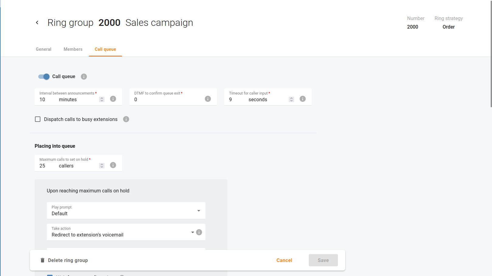

# Automated Call Distribution

## Overview

In the bustling world of call centers, where customer interactions are pivotal, an Automated Call Distribution (ACD) solution is designed to streamline operations and elevate customer engagement. Your ACD system seamlessly manages incoming calls, intelligently routes them, and ensures efficient call queueing, providing a foundation for exceptional customer service.

## Distinguishing IVR from ACD

Interactive Voice Response (IVR) is a technology facilitating user interaction with an automated system before connecting them with an agent. IVR aids in identifying the nature of the user's query, directing them to the appropriate assistance.

IVRs achieve this by prompting users to press specific keys on their phones corresponding to their needs. For instance, an IVR might instruct, "Press 1 for product purchases." Subsequently, the ACD processes this input, linking users with relevant sales agents, and avoiding unnecessary transfers to unrelated departments.

In essence, IVR serves as a data collection tool, while ACD utilizes this information to organize and allocate calls. The synergy of IVR and ACD enhances both customer satisfaction and workforce engagement within the call center environment.

## How ACD Works

The ACD workflow is comprised of three distinct stages:

1. **Caller Identification**: The initial phase involves gathering the caller's intent through an IVR interaction. Additionally, your IVR can be configured to let callers choose their language.
    - e.g. Callers will hear an IVR menu in English when they press 1, and callers need to press 2 to select an IVR menu in German.

2. **Call Queueing**: Following identification, the subsequent step involves organizing callers into a waiting list: when the number of incoming calls exceeds the number of available agents (customer service representatives) in a department, the incoming calls can be lined up in a call queue.

3. **Call Routing**: The culmination of the process is call routing. Here, the ACD employs your chosen distribution strategy to direct calls. Should your aim be prompt customer service, the ACD can seamlessly connect the incoming call to an available agent.

Choose your path to optimal call distribution by selecting a corresponding ring strategy: your ACD system offers an array of distribution strategies to cater to your unique needs. Open menu "Cloud PBX > Ring groups" to select a ring group and click "Edit". On tab "General" enable the most suitable ring strategy.

 - Open menu "**Cloud PBX > Ring groups**" to select a ring group and click "**Edit**". On the "**General**" tab, enable the most suitable ring strategy.

- If **Order** is chosen, extensions will be called one by one from the first (topmost) to the last number until the call is answered.

- Choose **Random** if you want to use a random order.
- **Simultaneous** enables simultaneous calls to every extension from the list.

- If you choose **Least used**, this sorts the phone lines in descending order beginning with their last usage, and delivers a call to their extensions, accordingly.

## Call Queues

If your organization receives a high volume of calls from clients, utilizing call queues ensures that every incoming call is managed effectively, allowing dedicated attention to each valued client.

- Open menu "Cloud PBX > Ring groups" to select a ring group and click "Edit".
- On the "Call queue" tab, enable the call queue for the selected ring group. This places callers on hold to wait for an agent to become available and accept the call.

### Call Queue Configuration Options

1. **Interval between announcements**: Define how often callers hear announcements about the number of callers ahead of them in the queue and the estimated wait time until someone attends to them. The default value is 5 minutes.
2. **DTMF to confirm queue exit**: Specify the DTMF code that callers should dial to exit the call queue and take a specific action, e.g. leave a voicemail (the action depends on the Take actions field). The default code is “0”.
3. **Timeout for caller input**: Define the time period when callers can dial the DTMF code. The default period is 9 seconds after the announcement that suggests taking a specific action (the action is defined in the Take action fields).
4. **Dispatch calls to busy extensions**: When this checkbox is selected, calls from the call queue are directed to agents even when they are already on the phone.

### Groups of Settings that Control the Call-Queue Experience

#### Placing into Queue

Configure how the busy call queue should handle new incoming calls when all agents are busy.

1. **Maximum calls to set on hold**: The maximum number of calls that can be placed on hold within this queue.
2. **Upon reaching maximum calls on hold**:
    - **Play prompt**: Upload a custom announcement to be played when the maximum number of incoming calls is reached.
    - **Take action**: Select the action taken automatically or upon confirmation when the maximum number of incoming calls is reached. Possible actions include:
        - Disconnect
        - Redirect to extension
        - Redirect to extension’s voicemail
        - Redirect to another call queue
        - Return to auto-attendant menu
    - **Wait for user confirmation**: When this checkbox is selected, callers have to dial the DTMF code, e.g., “0” to take action (the code is specified within the DTMF to confirm queue exit option). By default, this option is disabled and the action (defined in the Take action field) will be taken automatically.

#### Waiting in Queue

Configure how the busy call queue should handle callers waiting for an agent.

1. **Announce the number of callers ahead of them in the queue**: When selected, callers hear an announcement stating the number of callers ahead of them in the queue.
2. **Announce estimated wait time**: When selected, callers will hear an announcement about the estimated wait time.
3. **Play music on hold**: Upload a media file for callers to hear instead of the standard ringback tone. The maximum allowed file size is 5 MB.
4. **Maximum waiting time**: Define the time limit for the callers to wait in the call queue before they hear an announcement suggesting them to take a specific action, e.g., “Redirect to voicemail”.
5. **When waiting time passes**:
    - **Play prompt**: Upload a custom announcement to be played when the waiting time limit is reached.
    - **Take action**: Select the action taken automatically or upon confirmation when the waiting time limit is reached. Possible actions include:
        - None
        - Redirect to extension
        - Redirect to extension’s voicemail
        - Redirect to another call queue
        - Return to auto-attendant menu
    - **Wait for user confirmation**: When this checkbox is selected, callers have to dial the DTMF code, e.g., “0” to take action (the code is specified within the DTMF to confirm queue exit option). By default, this option is disabled and the action (defined in the Take action field) will be taken automatically.

#### Ringing Operators

Configure how the call queue should handle queued calls when no agent is picking up.

1. **Maximum ringing time**: Define the maximum period that the first caller in the queue can wait until an agent picks up the call.
2. **When ringing time passes**:
    - **Play prompt**: Upload a custom announcement to be played when the ringing time limit is reached.
    - **Take action**: Select the action taken automatically or upon confirmation when the ringing time limit is reached. Possible actions include:
        - None
        - Redirect to extension
        - Redirect to extension’s voicemail
        - Redirect to another call queue
        - Return to auto-attendant menu
    - **Wait for user confirmation**: When this checkbox is selected, callers have to dial the DTMF code, e.g., “0” to take action (the code is specified within the DTMF to confirm queue exit option). By default, this option is disabled and the action (defined in the Take action field) will be taken automatically.