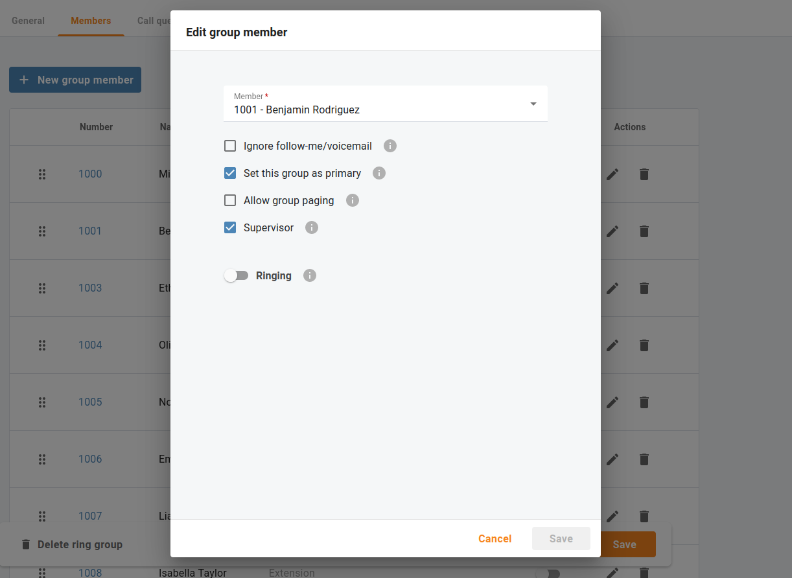

<b>Overview</b>

Cloud PBX managers that use Cloud PBX can supervise their colleagues’ calls in real time. For example, a manager can listen in on a sales agent’s calls, guide them, and, if needed, participate in the calls.

| Make sure "Call supervision" is enabled for your Cloud PBX.|
| --- |

Call supervision is available in three modes

- **Spy mode** – a manager can join an active call to listen in on the agent and the client's conversation without revealing the manager’s presence. For example, managers can silently monitor calls to provide feedback afterward and suggest improvements to agents’ communication skills.
- **Whisper mode** – a manager can speak to the agent directly while the client is not hearing the manager. The manager can assist the agent and give tips during the conversation with the client. For example, managers can use this mode when training new agents.
- **Barge-in mode** – a manager can speak to both parties – the agent and the client. For example, the agent has trouble handling the client’s concern, so the agent asks the manager for assistance. The manager joins the call using the barge-in mode to speak to the client directly.

A manager can choose any of these modes when joining an active call and switch between modes during the call.

## Service codes

Open menu "Calls > Settings > Service codes" to check your default service codes.

For example, to join a call made by an agent with extension 888 in the whisper mode, a manager dials the corresponding prefix followed by the extension: `*91888`. To switch, e.g., from the whisper mode to spy mode, the manager dials the DTMF for the spy mode: `0`. To switch to the barge-in mode, the manager dials `2`.

## Granting permissions to supervisors

If your company has a call center with customer support and sales teams, you need to grant permissions to those users who are empowered to supervise other employees. For example, Benjamin is a manager of the customer support team. He is authorized to join agents’ calls to assist or provide feedback.

Open menu "Cloud PBX > Ring groups > Members" and select the check box "Supervisor" to authorize Benjamin to access the other ring group members’ calls.

## Supervising calls

Now let's consider an example: Olivia (extension 1004) is a new support agent who recently joined Benjamin's team. Benjamin sees in the list of "Current calls" that Olivia has an active call with a client.

Benjamin decides to check how Olivia is handling the call. To join the call in spy mode, Benjamin dials `*901004` (where `*90` is the Spy mode prefix and `1004` is Olivia’s extension). Now Benjamin can hear the conversation.

## Switching call supervision modes in the middle of a call

Olivia answers a few of the client’s questions. When the client asks another question, Olivia can’t find the required information. Olivia requests assistance from Benjamin in the corporate chat. Benjamin has already been listening in on this call, so he switches to the Whisper mode by dialing `1`. Benjamin tells Olivia how to find the information.

The client keeps asking about the service details. Benjamin decides that Olivia needs help in handling this call. Benjamin switches to the Barge-in mode by dialing `2`, introduces himself to the client, and explains the relevant details. The client is satisfied with the provided information, and the call ends.
