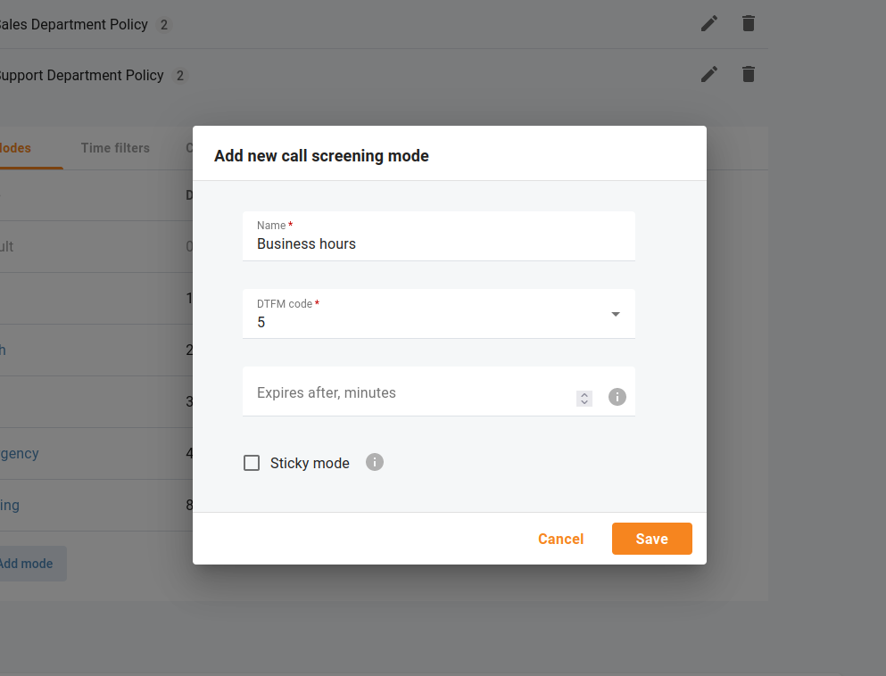

# Calls Within Business Hours and Non-Working Hours

## Call Screening

Sometimes incoming calls need to be treated differently: calls from your clients or suppliers should reach your employees on their office phones during weekdays, while other calls can just go to voicemail. Calls in the evening hours should go straight to their cell phones (there is no point in ringing their IP phones while employees are not in the office), while calls from anonymous numbers should always be rejected.

All of this can be done using the call screening rules in your Cloud PBX. When the call screening feature is enabled for a phone line (e.g., an extension or an auto-attendant), you can enable policies that consist of a set of rules. Such rules will be applied to every incoming call when certain conditions are met:

- **Time filters** – call time condition. You can specify limitations regarding the time of day, day of the week, day of the month, or some combination of these. This is ideal for making sure your phone will not ring in the middle of the night.
- **Caller numbers (From)** – calling number condition. You can specify a list of phone numbers for a caller (ANI or CLI) which satisfy this condition, e.g., you can list extensions, landline phone numbers, and so on. When specifying a phone number, you can enter either the full number or a pattern (e.g., all numbers starting with 1800).
- **Called numbers (To)** – called number condition. This can be useful if you have DID numbers associated with certain departments. For instance, you may wish to treat incoming calls to your Support number differently from calls to your Sales phone number.

## Call Screening Algorithm

When a new call arrives at your Cloud PBX, call information is sequentially checked against all defined call screening rules. The call information (ANI, DNIS, and current time) is checked against each rule’s conditions. If at least one of these does not match, the rule is skipped and processing moves on to the next one. If there is a match for all three conditions, then the rule’s actions are executed and no further rules are processed.

| The order of rules matters. When the call arrives at Cloud PBX, it checks the rules from top to bottom. The first rule that matches the call is applied, and the other rules are ignored. |
| --- |

Open menu "Calls > Settings > Call screening" and change the order of rules using drag and drop.

If none of the rules matches (or if no call processing rules have been defined), then the default rule is applied, as follows:

1. Ring on the IP phone.
2. If not answered within a certain time (defined by the Timeout parameter in "Call settings" of a selected extension), and if the phone line has call forwarding enabled, attempt to connect the call to the phone numbers listed there.
3. If the call is still not answered and the phone line has the "Unified messaging" enabled, forward the call to voicemail; otherwise, drop the call.

## Modes to Handle Incoming Calls (Business Hours, Non-Working Hours)

Cloud PBX users can use modes to control when and how calls come through to their phone line and quickly change the way incoming calls are handled. For example, they can set their mode to accept calls during business hours, send all calls to voicemail at once during non-working hours, and forward calls to another colleague when on vacation. Cloud PBX users can change the mode for their extension by calling the IVR or on their self-care interface.

The Cloud PBX manager can quickly change the way incoming calls are handled for all Cloud PBX extensions at once. Say the entire staff has to leave for a fire drill – the Cloud PBX manager opens menu "Cloud PBX > Extensions" and clicks "Switch mode" to change the mode from "Default" to "Emergency". Now, all incoming calls will be forwarded directly to mobile phones, and everyone who phones the office still receives assistance.

This is how it works:

Let’s say your company has three modes configured: "Business hours", "Non-working hours", and "Emergency". Each mode has a unique Dual-Tone Multi-Frequency (DTMF) code that is used for switching. Mary, a sales agent, goes out for business lunch (during business hours) and doesn’t want any calls to disturb her colleagues in the office. Thus, to forward all calls to voicemail at once, Mary dials `*61` on her phone and specifies the DTMF code for "Non-working hours" mode. Once the mode is changed, Mary stops receiving calls, both from clients and other agents. All the calls are forwarded to voicemail. In two hours, Mary comes back to the office. She dials `*61` on her phone again and changes the mode to business hours, meaning now she can receive calls.

## Add a New Mode

| "Default" mode is present in the system. The DTMF code of the "Default" mode is always zero (0). This DTMF code is used to switch to this mode. Users can switch from individual sticky mode to "Default" mode to continue receiving calls according to the rules defined for the "Default" mode. Open menu "Calls > Settings > Call screening" and click "Add mode" to configure a new mode. You can set the following parameters for a mode: |
| --- |

- **DTMF code** – this is a unique DTMF code of the mode. Users dial it to switch to this mode. Digits from 1 to 9 are available.
- **Expires after, minutes** – this is mode duration in minutes, after which the mode automatically switches to "Default" mode. For example, there is a "Meeting" mode with 60 min duration. If Mary switches to "Meeting" mode at 3 p.m, the mode switches to "Default" mode at 4 p.m.
- **Sticky mode** – if the mode is marked sticky, only extensions can set this mode. If the Cloud PBX manager switches all the extensions to the other mode, this change doesn’t influence the extensions with sticky mode. These extensions remain in this mode until they change it via IVR or their self-care interface, or sticky mode’s timeout ends.

## Response Messages for Incoming Calls

Cloud PBX users can record a personalized audio message via IVR to play to their callers before the call is answered, forwarded, or redirected to voicemail.

### Add a New Response Message

You can upload different audio files to be used as response messages for your company. Open menu "Calls > Settings > Call screening" and click <b>"Add message"</b> to upload a new audio file.

The audio message can be in .wav, .mp3, .og, or .au format and should not exceed the size of 3 MB. The message, added by Cloud PBX users, always overrides the default message added by the Cloud PBX manager, no matter whether it is recorded via the IVR or uploaded via the web portal.

## Policies

The policy contains a set of rules that define whether to play the response message (personalized audio message to play to callers before the call is answered) and what call action to apply (e.g., ring, forward, voicemail). Your Cloud PBX may have several policies, e.g., a policy for each company department.

### Add a New Policy

Open menu "Calls > Settings > Call screening" and click "Add policy" to configure a new policy.

For example, individual policies for Sales Department, Support Department, and IT Support Department to meet their SLA.

### Add Rules to Policies

Any policy contains a set of rules. Click "Add rule" to add a rule to the specific policy by selecting the appropriate conditions:

- **From** – calling number condition.
- **To** – called number condition.
- **Period** – call time condition.
- **Mode** – mode condition.

Define which actions should be executed for incoming calls, and optionally select the audio file in the "Response message" drop-down list.

### Enable Policies

Open the "Call screening" tab to enable a policy for a specific extension or an auto-attendant.

## Service Codes

Cloud PBX users can use service codes to control modes. Open menu "Calls > Settings > Service codes" to check your default service codes.

For example:

- `62` - Cloud PBX management default code (when called, the response message for all phone lines of a certain customer changes)
- `61` - individual management default code (when called, the response message for a single phone line changes).
