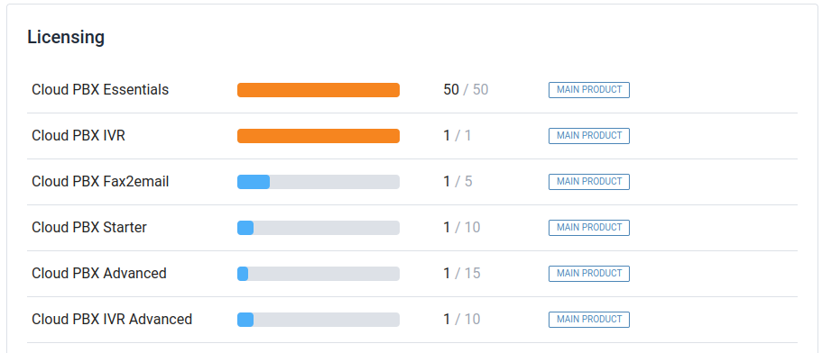
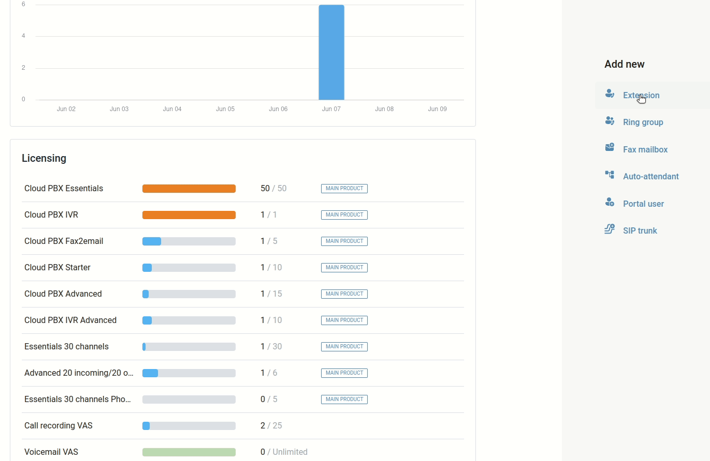
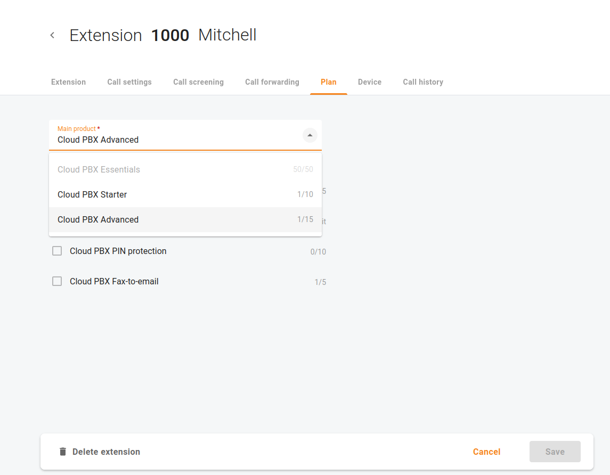
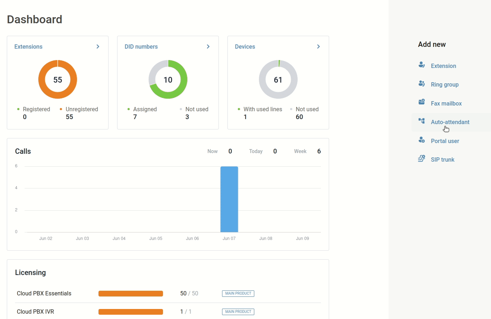
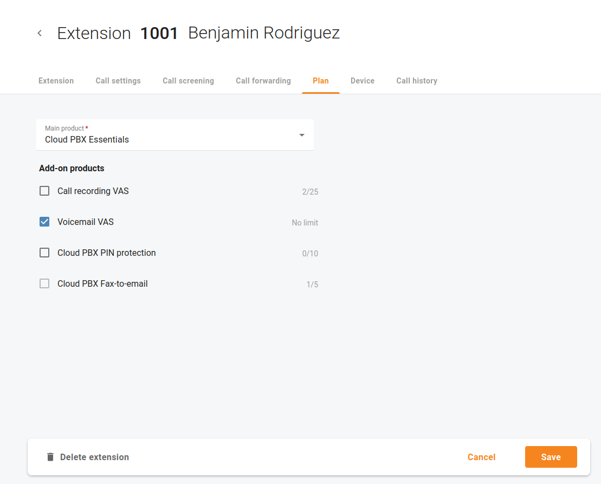

# Licensing
## Overview

Open the **Dashboard** to check the terms and conditions regarding the use of products and services, including licensing terms.

## Main products

Your licensing terms define the set of **main products** that your administrators can add to your service package via the Cloud PBX portal.
*e.g. "Up to 10 Cloud PBX phone lines for $30/month"*

| Check out the maximum number of phone lines with a specific product that your users may have on the Dashboard. |
| --- |

### Add a new extension

Open the **Dashboard** or menu "**Cloud PBX** \> **Extensions**".  Add new extensions by choosing the product that fits best.

Click "**Add new extension**" to set up a phone line for a user.

You can assign an IP phone to this extension to make sure that the phone gets automatically provisioned with all the network settings

### Change the main product

Open tab "**Plan**" to change the main product for a selected extension.

| Check out the maximum number of phone lines with a specific product that your users may have. |
| --- |

### Add a new auto-attendant

Open the **Dashboard** or menu "**Cloud PBX** \> **Auto-attendants**". Add a new auto-attendant by choosing its main product and selecting a DID number or multiple DID numbers which callers will dial when they need to contact you.
Click "**Add new auto-attendant**" to set up an IVR.

You can define your business hours when this auto-attendant will trigger different actions.

*e.g. Monday-Friday, from 8AM till 5PM, play a greeting and announce available options for callers*

## Add-on products

Your licensing terms also define the set of **add-on products** that your administrators can activate for your users and phone lines.

*e.g. "Unlimited voicemail boxes, $5/month per each"*

| Check out the maximum number of phone lines with a specific product that your users may have on the Dashboard. |
| --- |

Add-on products can be activated on tab "**Plan**".

Select a corresponding add-on product in order to activate value-added services such as:

* Voicemail
* PIN protection
* Call recording
* Additional SIP channels for SIP trunks