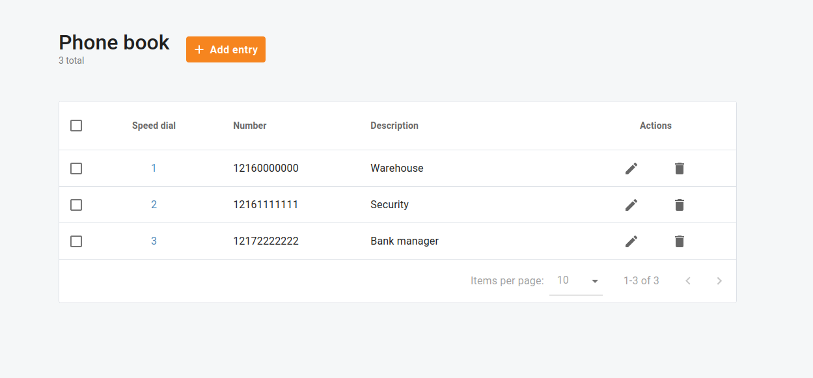
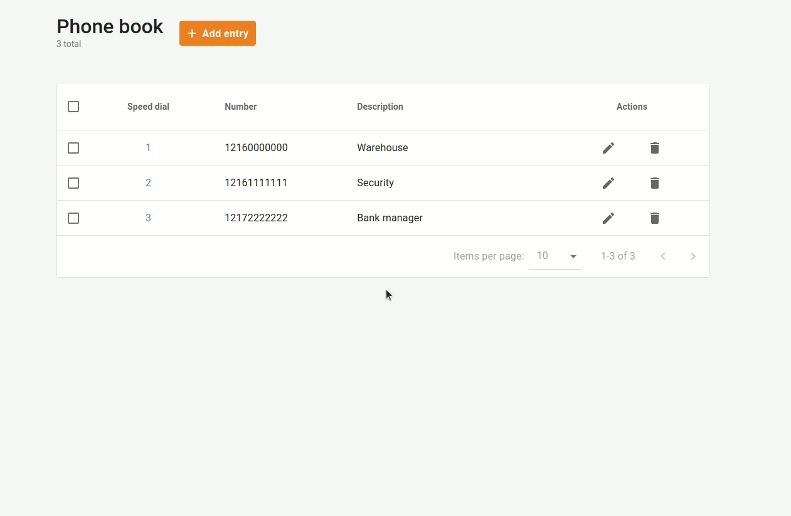
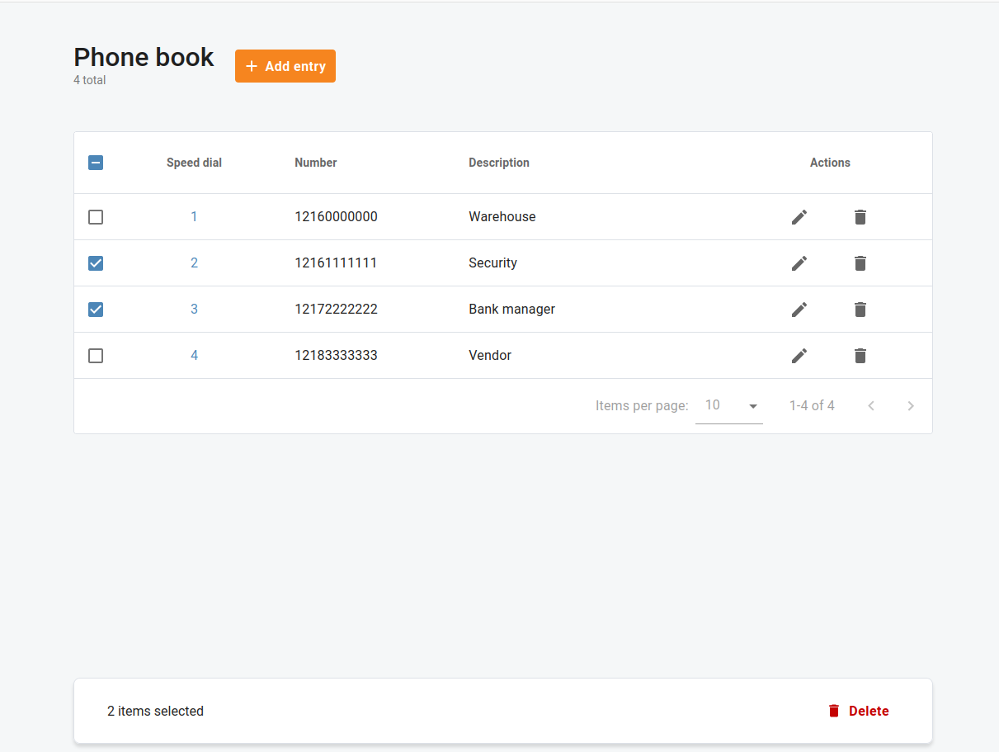

# Phone Book

## Overview

Use the **Phone Book** to organize commonly used phone numbers under a general directory and allow users to dial them by using short numbers (also known as Speed Dial numbers).

You can define a list of phone extensions for your Cloud PBX, plus create abbreviated dialing for external phone numbers.

You can set up dialing rules as an international prefix, outside prefix, direct number (e.g. 911), or abbreviated dialing for your accounts.

| Phone numbers must be entered in the E.164 format. |
| --- |

## Add a New Phone Book Entry

Open menu **"Cloud PBX > Phone book"**. Click **"Add entry"** to add a new speed dial number.

You can assign a short number the end users will dial on their phones. The maximum number length is limited to 15 characters.

| A speed dial must not coincide with an extension number for the system to correctly convert the number where to route the call. |
| --- |

Next, enter the actual destination number where the call will be forwarded in the E.164 format. Optionally, provide a description of this number, e.g. "John's IP phone"

## Delete Phone Book Entries

Open menu **"Cloud PBX > Phone book"**.

| A top checkbox next to **"Speed dial"** allows you to select all the phone book entries from the current page. |
| --- |

Select one or more phone book entries and click "Delete".

 