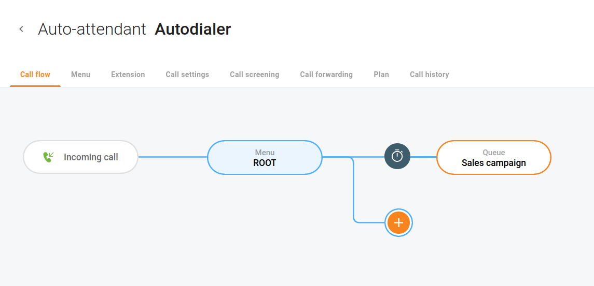
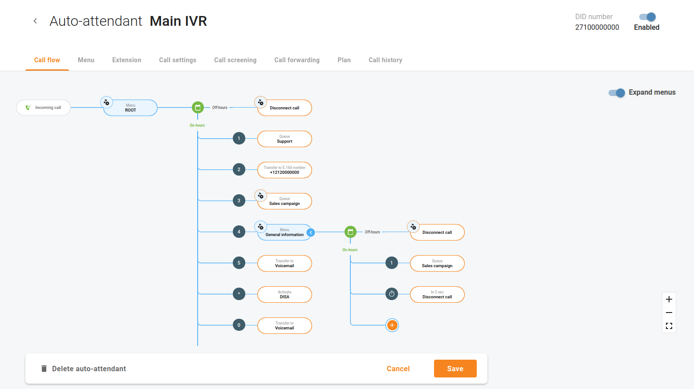

Overview
The auto-attendant functionality allows callers to be automatically transferred to an extension without first going through a telephone operator or receptionist. For a caller to find a user on a phone system, a dial-by-name directory is usually available. This feature lists users by name; therefore, the caller can press a key to automatically ring the user’s extension once the auto-attendant has announced it. The auto-attendant can also route calls to mobile phones, VoIP virtual phones, other auto-attendants, or other locations that use traditional landline phones. If a user is not available, the auto-attendant directs callers to the appropriate voice mailbox for the caller to leave a voicemail message.

Open menu "Cloud PBX > Auto-attendants" to see auto-attendant(s) configured for your Cloud PBX.

The auto-attendant may be composed of a set of independent menus (for example, one menu can be used to route calls within the Support Department, and others – within the Sales Department). All of them are identical in every respect, except for the ROOT menu, which is always present and cannot be deleted, and whose name cannot be changed.

Auto-attendants with always active menus
The flow of incoming calls to an auto-attendant number is always routed to menu "ROOT" first.

If you need to configure a menu that is always active, hover over menu "ROOT" and click "Change menu settings".

On tab "**Settings**" select radio button "Always" to set this menu so it is always active.

On tab "**Prompts**" enable options to upload greetings and guidance for people who call your number.

\* **Intro** – the prompt is played when the menu is entered for the first time.
e.g.“Welcome to ACME, a security solutions company!”

\* **Menu** – the menu prompt that will be guiding callers.
    e.g. “Press 1 for sales, press 2 for technical support”.

\* **On timeout** – the prompt that will be assisting callers in case they exceed the waiting time.

\* **On unavailable selection** – the prompt that will be assisting callers in case they press a wrong key.

Click "**+**" on tab "Call flow" or open a selected menu and open tab "Actions" to assign actions to different events.

e.g. When a caller presses 1, redirect them to call queue "Support”.

| Enable option "Play before action" to upload a prompt that must be played prior to the selected action. |
| --- |

Auto-attendants with menus that have custom schedules
The auto-attendant may be composed of a set of independent menus that can be active at different times.

e.g. One menu can be used during business hours, and others – during non-business hours and on weekends.

Consider the following example: your company wants to configure the auto-attendant functionality so that different menus will answer calls during business and non-business hours. During business hours, you also want the caller to hear a welcome prompt first and then the menu prompt. Your company has two departments (sales and support) that you wish to make available to the caller. When a caller dials from a landline, they hear a recorded voice greeting that offers connection options, such as, “Hello! You have reached SmartCall Ltd. To reach the sales department, Press 1; to reach the support department, Press 2. If you know the extension of the person you are trying to reach, you can dial that now.”

When adding a new auto-attendant, you can define your company's business hours. You can specify the opening and closing times for the entire week.

e.g. Business hours are 08:00 AM - 05:00 PM, Monday to Friday.

If you need to change the business hours for a particular day, you can redefine "**Custom schedule**" for the menu that is active during business hours.

e.g. Business hours normally are 08:00 AM - 05:00 PM, Monday to Friday, except Tuesday. On Tuesday, the business hours are 11:00 AM - 07:59 PM.

Open the menu that is active during business hours, and remove check box "**Tue**" for option "**Days**". Then click "**Add interval**" to add the opening and closing time on Tuesday.

| Exceptions/holidays may be defined in menu "ROOT". |
| --- |

This way, you can configure menu "**ROOT**" to process calls during weekends (and holidays) and the alternative menu – to process calls during business hours, and there’s one more menu for handling calls after business hours.

The flow of incoming calls to an auto-attendant number is always routed to menu "**ROOT**" first. If menu "**ROOT**" is not currently active, the calls are processed by the alternative menu specified in the menu’s option "**When the menu is inactive**".

If the alternative menu is not active either, the calls are routed to the menu specified in the alternative menu’s option "When the menu is inactive", etc.

| Enable option "Expand menus" to see how different menus are logically linked. |
| --- |

