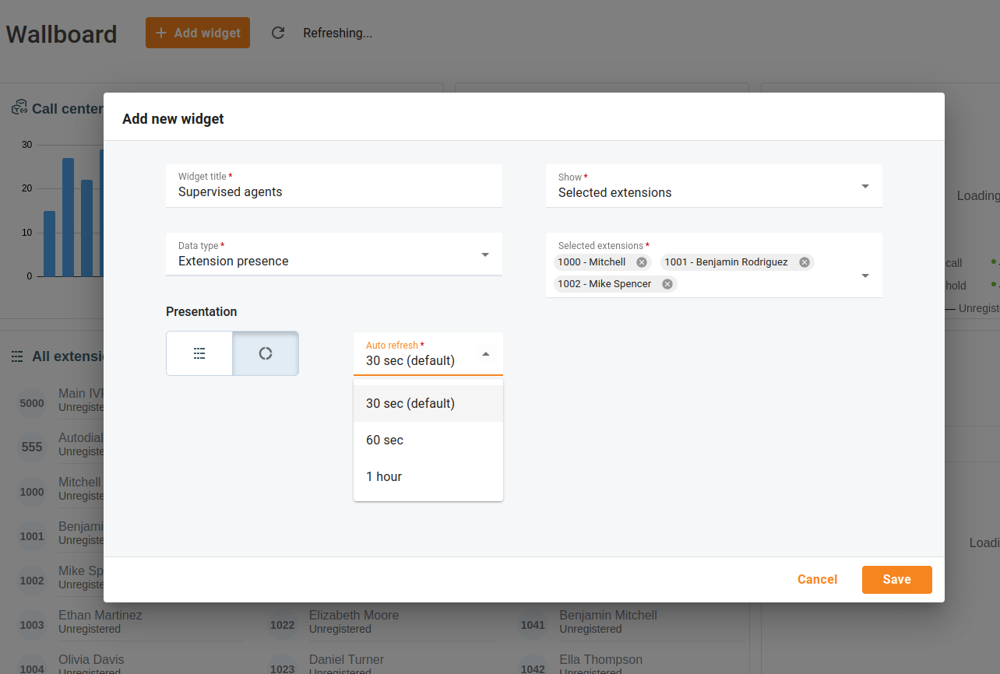
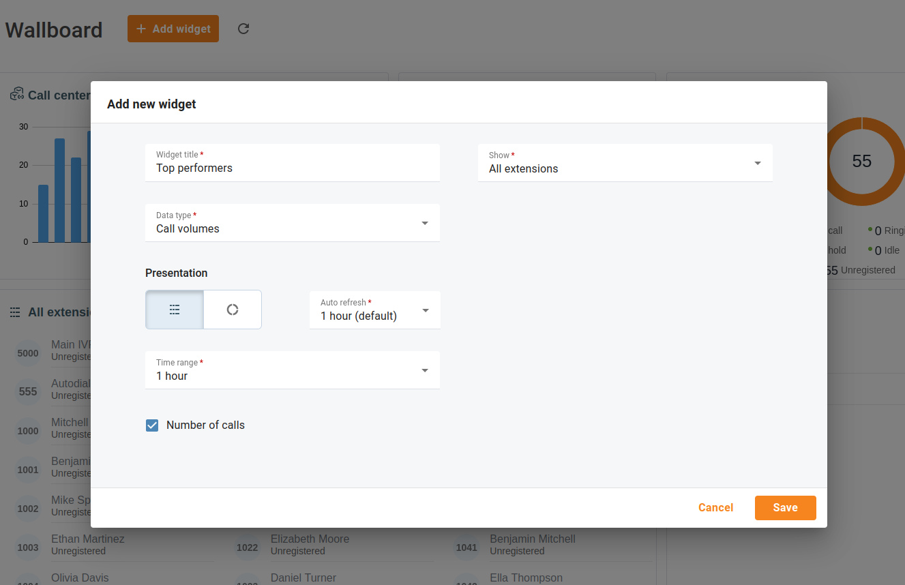
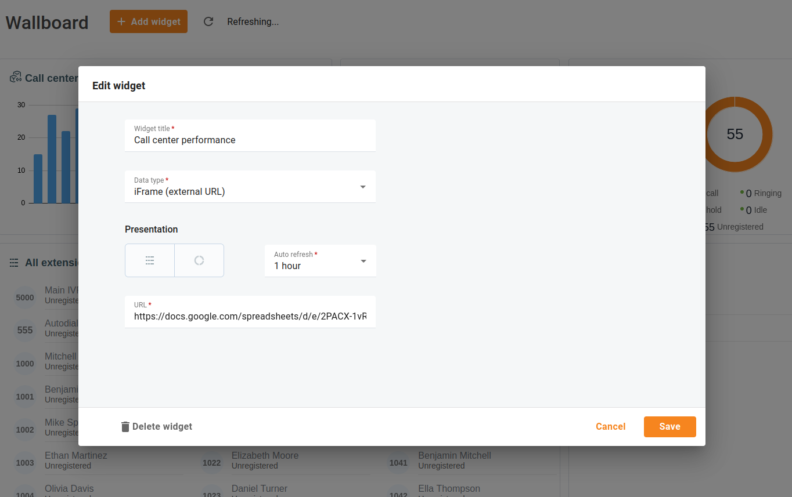

# Wallboard
## Overview

The wallboard functionality is a powerful tool that enables managers to monitor agent performance, gain insights into call volumes, and even integrate external systems for a comprehensive view of their call center's operations.

| Select if you want the widget data to be presented as Table or Donut chart |
| --- |

Open menu "**Cloud PBX** \> **Wallboard**".

Customize the wallboard by adding widgets of different types. The wallboard can be displayed on large screens within the call center premises to ensure that every agent has easy access to the statistics and reports.

*e.g. Call centers can utilize wall-mounted TVs or monitors, video walls, or digital signage.*

Click "**Add widget**" to add a new widget, select its type, and define how frequently the data must be refreshed.

## Extension presence

Configure a widget and select specific extensions or a group of extensions you want to monitor. The "**Extension presence**" widget periodically refreshes the information and displays whether agents are on a call or available. This gives managers real-time visibility into their agents' status.

## Call volumes

Gain insights into call volumes and overall call traffic by configuring the "**Call volumes**" widget. The widget displays how many calls were handled, both incoming and outgoing, within a selected time range. It also provides the aggregate duration per agent.

## iFrame (external URL)

You can rely on various CRM and reporting software tools that may not be directly integrated with your Cloud PBX. This can sometimes make it challenging for you to access all the information you need in one place. By configuring the "**iFrame**" widget and adding the URL to the needed CRM report, you can seamlessly access statistics and reports generated in external systems.

