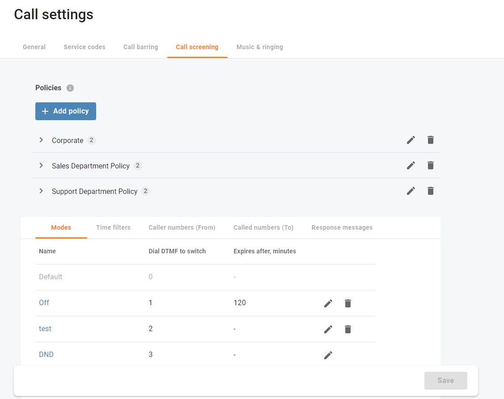
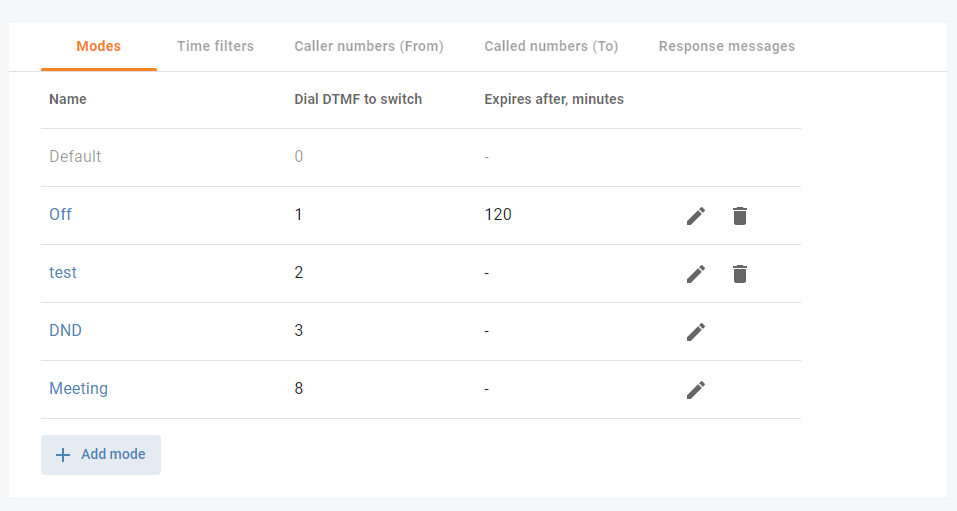
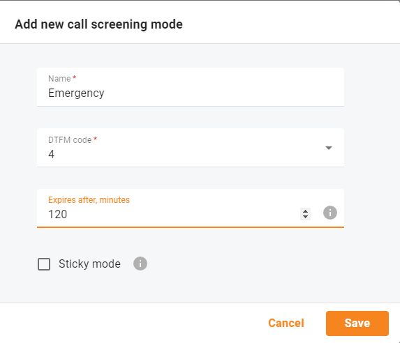
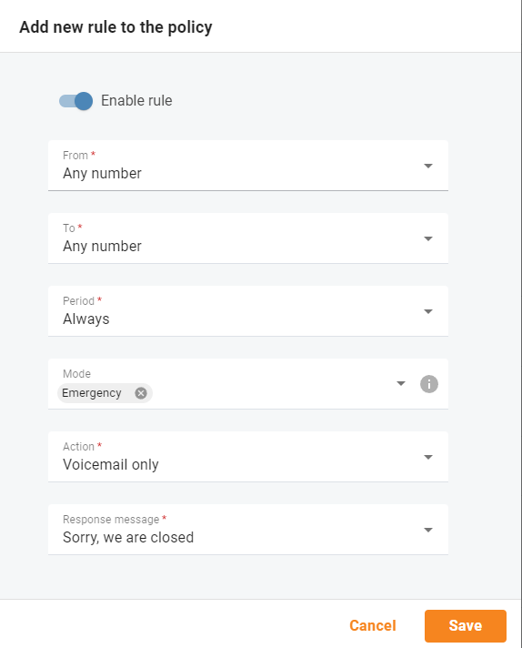

# Manage Operation Modes

Managers of the call centers ask us: 
 - what should we do if there is an emergency situation and we can't serve calls: fire alarm in the building or power outage.

## How it works

Let’s say ABC company has three modes configured: “Business hours”, “Non-working hours”, and “Emergency”. Each mode has a unique Dual-Tone Multi-Frequency (DTMF) code that is used for switching. Mary, a sales agent, goes out for business lunch (during business hours) and doesn’t want any calls to disturb her colleagues in the office. Thus, to forward all calls to voicemail at once, Mary dials \*61 on her phone and specifies the DTMF code for “Non-working hours” mode. Once the mode is changed, Mary stops receiving calls, both from clients and other agents. All the calls are forwarded to voicemail. In two hours, Mary comes back to the office. She dials \*61 on her phone again and changes the mode to business hours, meaning now she can receive calls.

### Benefits

* Call Center users have more control over the incoming calls so that they can quickly change the modes to control what calls to accept.
* Call Center administrators gain control over all incoming PBX calls. This allows for managing who can reach agents and at what time by quickly changing the way all incoming calls are handled via IVR.

## Create an operation mode "emergency"

### 1. To add an emergency mode, go to **Calls->Settings->Call screening** tab.

### 2. Scroll down the list until you see **+Add Module** button.

### 3. Fill in `Name`, `DTMF code` and `Expires after`.

### 4. Add new rule to the policy, in case of emergency mode - treat the calls in a special way.

## Test the emergency mode

From manager's phone:
 * dial *614 to activate the emergency mode.
 * dial *610 to switch back to the normal mode.