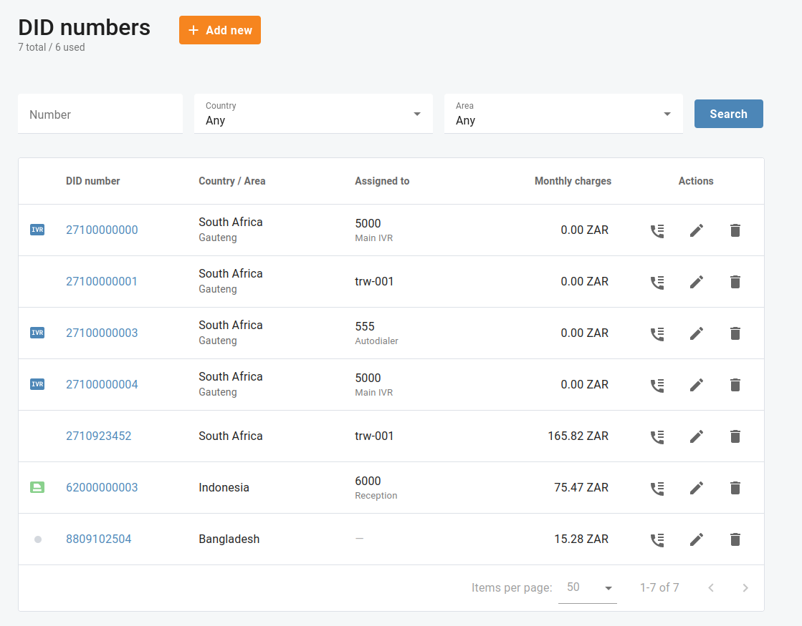
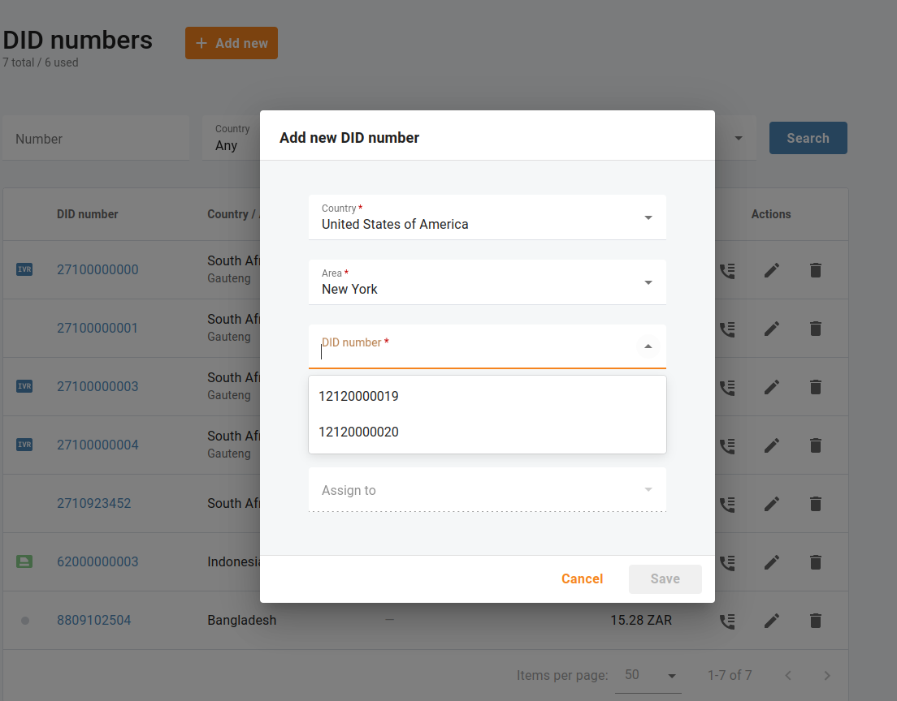
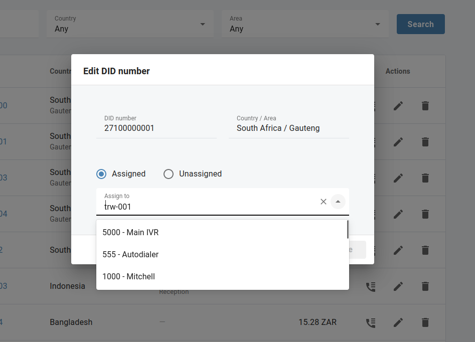
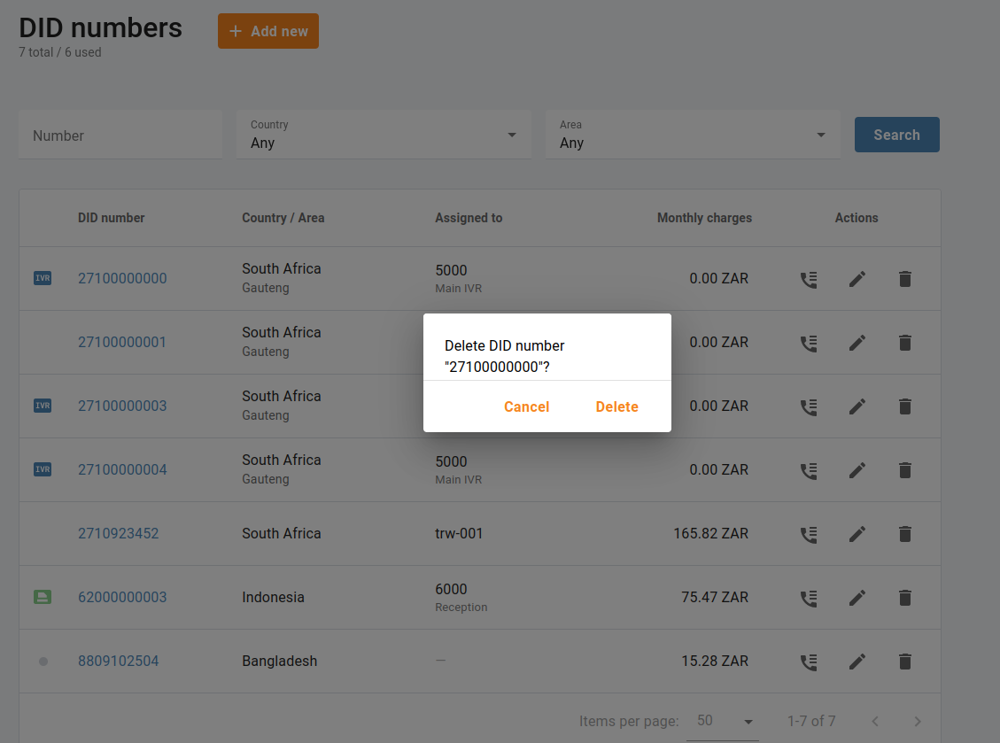
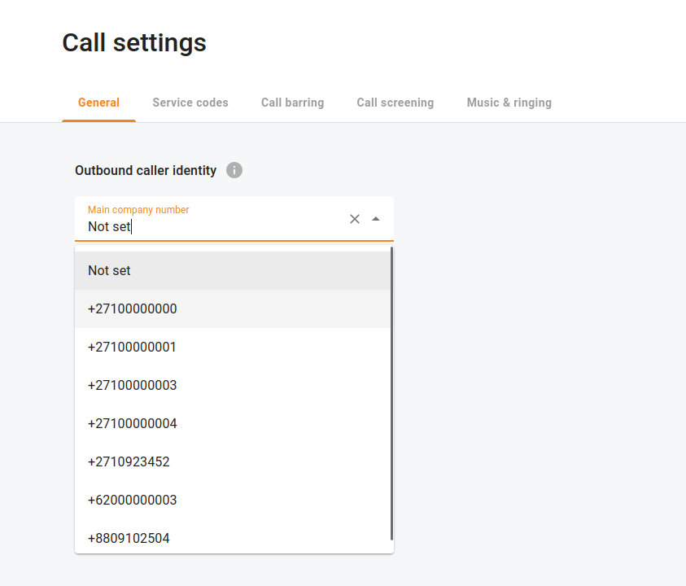
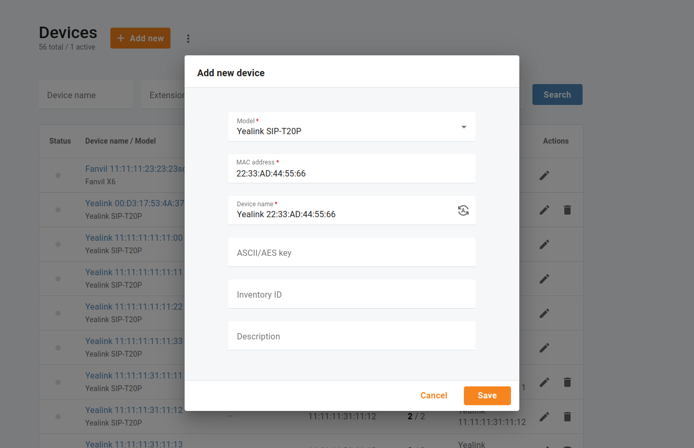
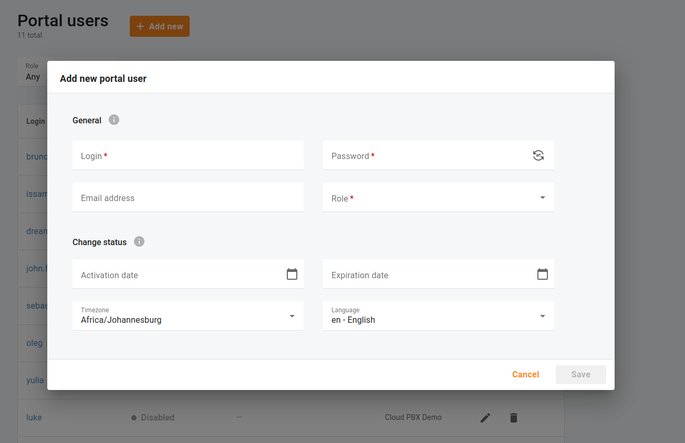

# Getting started

## Overview

Quickly configure the basics of your Cloud PBX, a business communication solution you will love.

## DID numbers

Menu "**Inventory** \> **DID numbers**" facilitates working with the list of Direct Inward Dialing (DID) numbers assigned to your Cloud PBX. Here, you can see a list of currently provisioned numbers (and which phone lines they are assigned to).

This menu can be used for geographical, non-geographical DID numbers, and for toll-free and premium numbers. Some DID numbers are offered on a “fixed monthly fee” basis, thus, you will see your monthly charges associated with such DID numbers.

### Add a new DID number

In order to enhance your communication capabilities and streamline your business operations, activating DID numbers on Cloud PBX is a crucial step. DID numbers enable your users to receive calls directly, bypassing the need for a receptionist or operator. This section will guide you through the process of activating DID numbers on Cloud PBX.

Open menu "**Inventory** \> **DID numbers**" and click "**Add new**". When activating a new DID number, you will typically have the option to select the country and area for the number. Choose the appropriate country and area based on your location or the preferences of your target audience. After selecting the desired area and country, you will typically be presented with a list of available numbers to choose from. Take a moment to review the options and select a number that best suits your needs.

| Check out your one-time activation and monthly recurring fee associated with a selected DID number. |
| --- |

You can immediately assign a selected DID number to any existing phone line. If your Cloud PBX has no phone lines yet, you will be able to add them later and then assign the selected DID numbers for proper call routing: open menu "**Inventory** \> **DID numbers**", click "**Edit**" and select a phone line to assign the DID number.

### Delete a DID number

If you no longer need a DID number, you can return it to your service provider. Open menu "**Inventory** \> **DID numbers**" and click "**Delete**". A deleted DID number will be immediately unassigned from your phone line.

### Main company number

Open menu "**Calls** \> **Settings** \> **General**" to select the main company number that will be displayed as a caller identity for outgoing calls made from all of your phone lines (unless this value is overridden for a particular extension). You can only select from DID numbers assigned to your Cloud PBX.

## Devices

You can get your SIP phones automatically provisioned, without having to configure each device individually.

Open menu "**Inventory** \> **Devices**" and click "**Add new**". Select the model of your device and fill in the details about your SIP phone, including its MAC address.

| Check out the MAC address of your SIP phone printed on a label located on the device itself: check the back, bottom, or sides of the phone for any stickers or labels that display the MAC address. It is usually a combination of letters and numbers separated by colons or dashes. |
| --- |

You can generate a device name which will consist of its model and MAC address.

*e.g. Yealink 22:33:AD:44:55:66*

## Portal users

Your Cloud PBX may be managed by multiple users with different permissions defined by their role.

### Add a new portal user

Open the **Dashboard** or menu "**My company** \> **Portal users**". Add new portal users by choosing their roles. If you define an email address for a new user, they will receive an email notification containing the necessary credentials to access your Cloud PBX portal.

| The languages that are currently supported are English, German, and Brazilian Portuguese. If you set any other languages for portal users, English will be used for them. |
| --- |

You can set up a portal user account’s activation date or define when this user becomes unusable. If you leave the expiration date empty, the user will not expire.