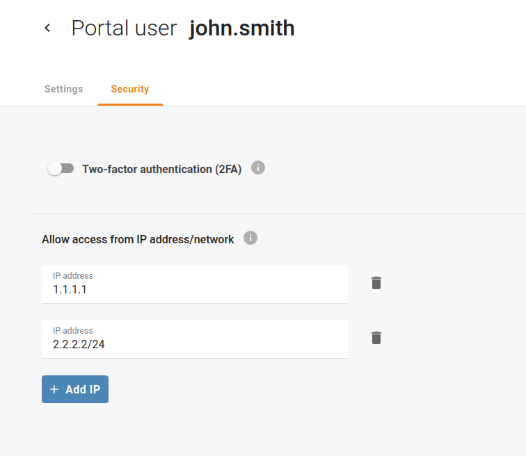

# Allow web access only from trusted IP addresses

For security reasons, you may want to allow access to the Cloud PBX portal for your own user or other portal users only from trusted IP addresses, e.g. IP addresses belonging to your office network. Open menu "My company > Portal users" and select a portal user for whom you need to define trusted IP addresses. Open tab "Security" and click "Add IP" to specify an IP address or network. You can add more than one trusted IP address or network.

| If a user tries to log in from outside of your network, the Cloud PBX portal denies their access and the user cannot log in. |
| --- |
Such IP restrictions add an extra layer of security to regular login and password.