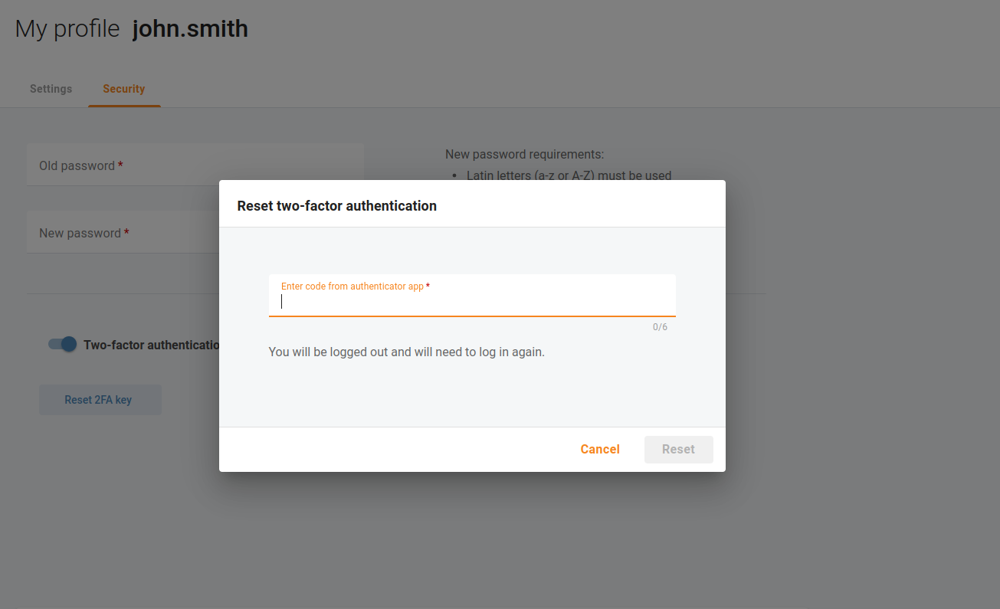

# Two-factor authentication

You can significantly increase the security level of your portal users' access to the Cloud PBX portal by using two-factor authentication (2FA). With enabled 2FA, users can log in only after entering a valid one-time password (OTP) in addition to their login and regular password. The time-based OTP is generated by a 2FA application, such as Google Authenticator, installed on the user’s smartphone. So, even if an unauthorized person gains access to user credentials, they can’t access the Cloud PBX portal without the OTP.

## Enable two-factor authentication for your own user

If you want to add an extra layer of security to your login and password, install an authenticator application on your mobile device (e.g. Google Authenticator: Android, iOS) and open menu "My company > My profile" or simply click on your login in the left bottom corner of the page. Open tab "Security" to enable two-factor authentication (2FA) for your own user. Scan the QR code or manually enter the shown key to your authenticator application. The authenticator application will then generate a one-time password that you need to enter below the QR code.

c

Now, two-factor authentication (2FA) has been configured for your login.

During the next login attempt, you will be asked to enter an OTP code.

| If you lost access to your authenticator app, contact the service provider or another portal user who can reset your 2FA key. |
| --- |

### Enable two-factor authentication for other users

You may want to enable two-factor authentication for other portal users. Open menu "My company > Portal users" and select a portal user for whom you need to enable two-factor authentication. Open tab "Security" to enable two-factor authentication (2FA) for the selected user.

During the next login attempt by that user, they will be asked to scan a QR code and enter an OTP code.

## Reset a two-factor authentication key

If you need to replace your mobile device where you installed your authenticator application, you can reset your two-factor authentication key. Open menu "My company > My profile" or simply click on your login in the left bottom corner of the page. Open tab "Security" to reset two-factor authentication (2FA) key for your own user. You will be asked to enter an OTP code.

| When a valid OTP code is provided, you will be logged out and will need to log in again. |
| --- |

During the next login attempt, you will be asked to scan a QR code and then enter an OTP code.

## Disable two-factor authentication for your own user

If you want to disable two-factor authentication for your own user, open menu "**My company > My profile**" or simply click on your login in the left bottom corner of the page. Open tab "**Security**" to disable two-factor authentication (2FA) for your own user. You will be asked to enter an OTP code.

## Disable two-factor authentication for other users

You may want to disable two-factor authentication for other portal users. Open menu "**My company > Portal users**" and select a portal user for whom you need to disable two-factor authentication. Open tab "**Security**" to disable two-factor authentication (2FA) for the selected user.

